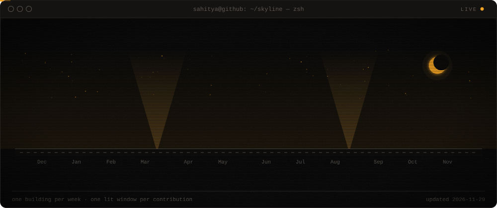

<p align="center">
  <a href="https://www.linkedin.com/in/sahityasingh08/">LinkedIn</a> &nbsp;·&nbsp;
  <a href="mailto:sahityasingh508002@gmail.com">sahityasingh508002@gmail.com</a> &nbsp;·&nbsp;
  <a href="https://en.opensuse.org/openSUSE:Members">openSUSE member</a> &nbsp;·&nbsp;
  Bengaluru, India
</p>


### <code>01</code> About

```yaml
name: Sahitya Singh
education: Computer Science, Newton School of Technology
community: openSUSE member
focus:
  - open source (static analysis and developer tooling)
  - web development
  - ML explainability
languages: [Java, Python, JavaScript]
tools: [Git, Docker, React, Linux]
```


### <code>02</code> Open source

| project | what I do |
|:--|:--|
| [**checkstyle/checkstyle**](https://github.com/checkstyle/checkstyle) | regular contributor, 20+ pull requests to the Java static-analysis tool |
| [checkstyle/contribution](https://github.com/checkstyle/contribution) · [sevntu.checkstyle](https://github.com/sevntu-checkstyle/sevntu.checkstyle) · [openrewrite-recipes](https://github.com/checkstyle/checkstyle-openrewrite-recipes) | companion repos: regression tooling, extra checks, automated fixes |
| [**openSUSE**](https://www.opensuse.org/) | community member |


### <code>03</code> Records


### <code>04</code> Commit history




### <code>05</code> Stack

<p>
           
</p>


<h3 align="center">Connect with me</h3>

<p align="center">
  <a href="https://www.linkedin.com/in/sahityasingh08/"></a>
  &nbsp;
  <a href="mailto:sahityasingh508002@gmail.com"></a>
</p>

<p align="center">
  <a href="https://github.com/sahityasingh08?tab=followers"></a>
  
  <a href="https://en.opensuse.org/openSUSE:Members"></a>
  <a href="https://github.com/checkstyle/checkstyle/pulls?q=is%3Apr+author%3Asahityasingh08"></a>
</p>

<p align="center"><sub>cards drawn by <a href="scripts/term.py">scripts/term.py</a> from public GitHub data · refreshed every 6 hours</sub></p>
